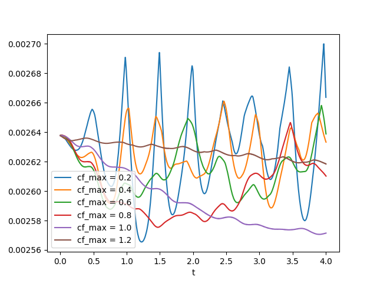
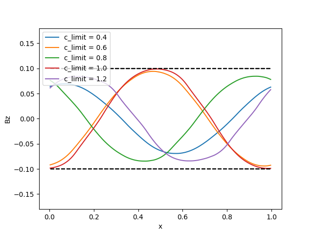

# mhd-boris

2.5D Constrained Transport Magnetohydrodynamics

Philip Mocz (2024), [@PMocz](https://x.com/PMocz)

Based on 
[algorithm write-up](https://levelup.gitconnected.com/create-your-own-constrained-transport-magnetohydrodynamics-simulation-with-python-276f787f537d)

See also: https://arxiv.org/abs/1902.02810

We solve equations (1) -- (8) in the paper above

Simulate the Orszag-Tang vortex MHD problem
with the Boris-like Integrator

Run the simulations (`python mhd-boris.py <prob_id> <c_limit>`) and produce analysis with:

```bash
python mhd-boris.py 1 2.4
python mhd-boris.py 1 2.2
python mhd-boris.py 1 2.0
python mhd-boris.py 1 1.8
python mhd-boris.py 1 1.6
python mhd-boris.py 2 32.0
python mhd-boris.py 2 16.0
python mhd-boris.py 2 8.0
python mhd-boris.py 2 4.0
python mhd-boris.py 2 2.0
python mhd-boris.py 2 1.0
python mhd-boris.py 2 0.5
python analysis.py
```


## 1. Orszag-Tang

Timesteps:


Density:


Magnetic Pressure:


Velocity:


Alfven Speed: 


Fast Speed:


## 2. Alfven Wave

Timesteps:




Bz lineout at final time:



