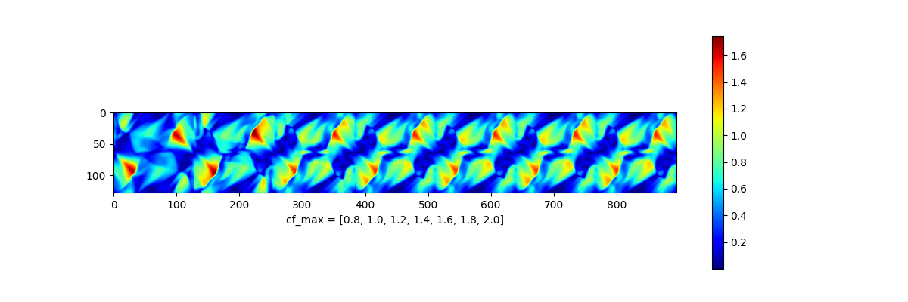
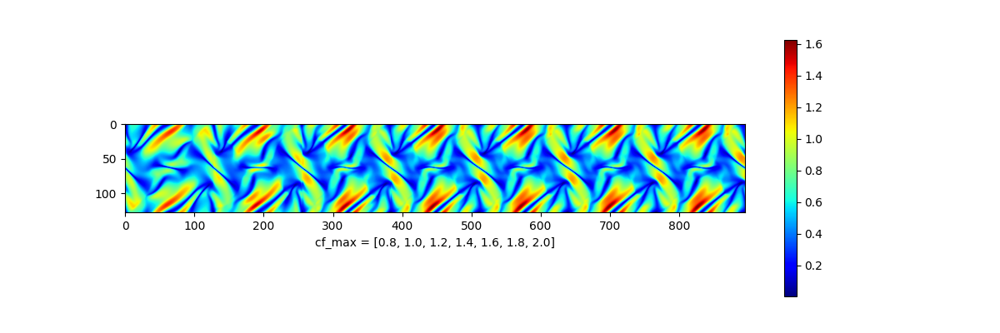
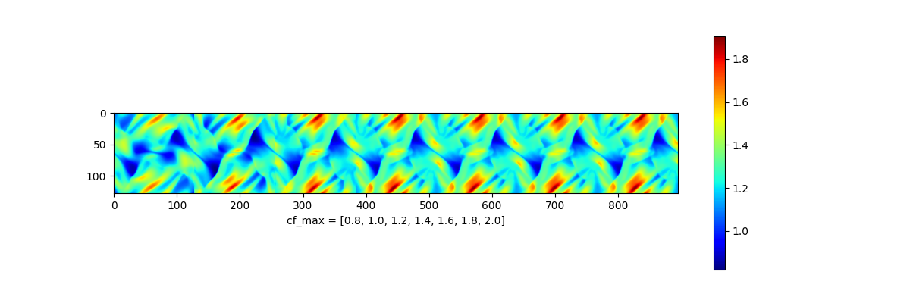

# mhd-boris
Finite Volume Constrained Transport simulation of the Orszag-Tang vortex

Philip Mocz (2024), [@PMocz](https://twitter.com/PMocz)

Based on 
[📝 Read the Algorithm Write-up on Medium](https://levelup.gitconnected.com/create-your-own-constrained-transport-magnetohydrodynamics-simulation-with-python-276f787f537d)

See also: https://arxiv.org/abs/1902.02810

Simulate the Orszag-Tang vortex MHD problem
with the Boris Integrator

Run the simulations and produce analysis with:

```bash
python mhd-boris.py 2.0
python mhd-boris.py 1.8
python mhd-boris.py 1.6
python mhd-boris.py 1.4
python mhd-boris.py 1.2
python mhd-boris.py 1.0
python mhd-boris.py 0.8
python analysis.py
```

Timesteps:


Density:


Magnetic Pressure:


Velocity:



Alfven Speed: 



Fast Speed:



